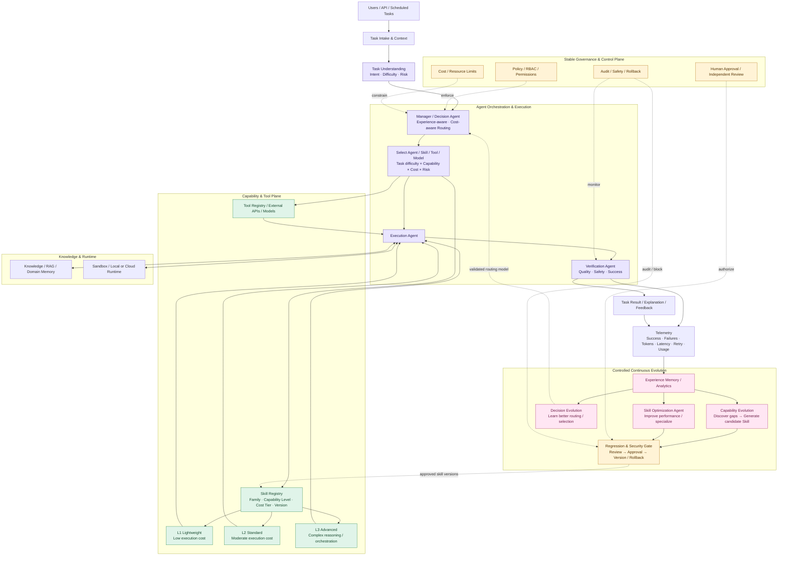
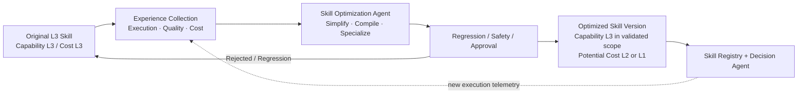

# CEAA v1.9 — System Architecture

> Architecture-Stable Continuous Evolution: 在穩定的核心架構與治理邊界下，透過經驗累積持續改善能力、決策與執行效能。

本圖為 [CEAA System Design v1.9](../../Capability-Evolving%20Agent%20Architecture%20%E2%80%94%20System%20Design%20v1.9.md) 的可編輯架構視圖。GitHub 支援直接渲染以下 Mermaid。

## End-to-End Architecture

## Skill Complexity Compression (Research Hypothesis)

**Capability Level 與 Execution Cost Tier 為獨立維度。** L3 代表複雜任務處理能力；經過優化後，在明確的適用任務範圍內，可能保留經驗證的 L3 能力、卻以接近 L1 的成本執行。這是研究假設，非保證結果。

## Research Objectives & Evaluation

- **Capability Evolution:** 增加任務覆蓋率，並驗證新 Skill 的品質與安全。
- **Decision Evolution:** 在成功率與風險限制下，學習選擇成本最合理的 Agent、Skill、Tool 與模型；HYSET 可作為 set-level tool retrieval baseline。
- **Performance Evolution:** 依使用頻率、失敗影響與預期節省額改善 Skill。
- **Skill Complexity Compression:** 測試高能力 Skill 經多次迭代後能否達到低成本 Tier，同時維持 Capability Retention。
- **Architecture Stability:** 優化不得繞過穩定的模組介面、Policy、Approval、Audit、Regression 與 Rollback。

核心指標包括 Task Success Rate、Cost per Successful Task、Skill Compression Ratio、Capability Retention Rate、Latency、Retry Count、Cumulative Net Saving 及 Break-even Reuse Count。訓練、驗證、優化與維護成本均須納入評估。

> 注意：本圖描述目標架構及研究設計，不表示所有模組均已實作或實驗假設已獲驗證。
